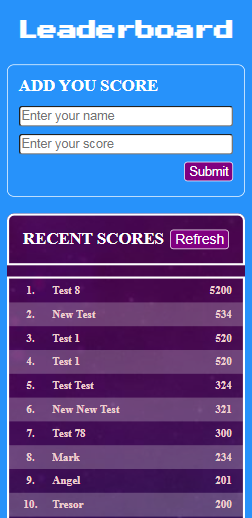

# Leaderboard

The leaderboard website displays scores submitted by different players. It also allows players to submit their own score. All data is preserved online, thanks to the [Leaderboard API service](https://www.notion.so/microverse/Leaderboard-API-service-24c0c3c116974ac49488d4eb0267ade3).

### Desktop Version

### Mobile Version

## Built With

- HTML, CSS and JavaScript (ES6)

## Live Demo

- [Live Demo Link](https://leaderboard-tek.netlify.app/)
- NB: The current updates will be deployed when the 'styling-teh-app' branch is merged to 'develop' branch.

## Getting Started

- Install Node.js ^12.13
- clone the repository by running\
    `git clone https://github.com/gtekle/leaderboard.git`
- navigate to the folder\
    `cd leaderboard`
- Install packages\
    `npm install`
- To run application using webpack-dev-server\
    `npm start`

## Authors

👤 **Tekle Gebreyohannes**

- GitHub: [@githubhandle](https://github.com/gtekle)
- LinkedIn: [LinkedIn](www.linkedin.com/in/tekle-gebreyohannes-kidanemariam-7605752b)

## 🤝 Contributing

Contributions, issues, and feature requests are welcome!

Feel free to check the [issues page](../../issues/).

## Show your support

Give a ⭐️ if you like this project!

## Acknowledgments

- [Microverse Inc](https://www.microverse.org/)

## 📝 License

This project is [MIT](./MIT.md) licensed.
